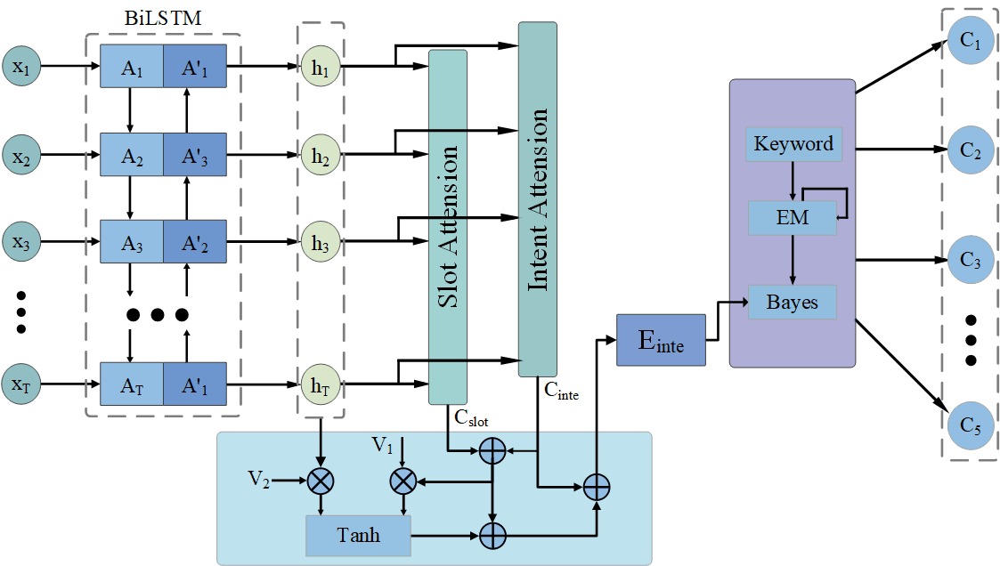
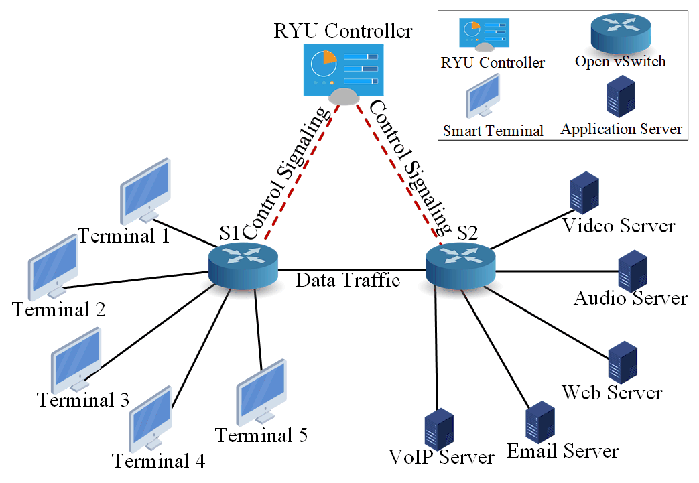

# IEMITN
We propose a new architecture called Intent Extraction and Mapping Intent to Network (IEMITN). IEMTIN extracts the intent reflected in the natural language of the end-device users and predict the type of traffic which requested in user device, rather than the identification of traffic that is already being forwarded. Then IEMITN dynamically customs policy based on the predicted result and current network conditions and deploys network in advance to optimise network transport.

Fig. 1 shows the functional module diagram of our architecture.
<center>
    
    <br>
    <div style="color:orange; border-bottom: 1px solid #d9d9d9;
    display: inline-block;
    color: #999;
    padding: 2px;">Fig. 1 Functional Module Fiagram</div>
</center>


Specifically, our contributions can be summarised as follows:
1. We propose a lightweight intent extraction model to extract intents from user natural language, and experimental results show that our intent extraction mechanism achieve an accuracy of 96.76%.
2. Predict the type of network traffic requested by the user based on the intent extraction results. Experimental results demonstrate that our mechanism successfully predicting the type of network traffic requested by the user with an accuracy of 98.0%.
3. According to the current network conditions, we make optimization policies for different intents when users send requests, and experimental results confirm that our mechanism which dynamically customising policies and deploying network in advance effectively optimize QoS.

We will introduce our IEMITN in three parts:
1. Intent Extraction from the natural language of the end-device users.
2. Map intents to network traffic.
3. Evaluate IEMITN for QoS optimization.
   
## Intent Extraction from the natural langugae of the end-device users
We first extract intent from natural language of end-devices users. We propose a slot gate which use the masages got from slot filling to enable intent extraction.
### Data
Our study targets mobile smart terminal device users. Therefore, we use the Snip dataset collected by the Snips personal voice assistant in the evaluation. The samples in this dataset consist of user-provided utterances and exhibit a level of complexity that makes them well-suited for our study. The dataset consists of 7 categories of intent types and 72 slot labels. We preprocess the dataset by adding 2 intent categories, 19 slot labels, and 100 data utterances for each intent type. The dataset can be get [here](./Data/snips).
### Deploy
Our model is support with CPU, while training may proceed at a significantly slower pace compared with using GPU.
#### Tensorflow
Our code is based on Tensorflow and supports Tensoflow-gpu1.11.0 now.
#### Installation
```python
conda create -n IEMITN1 python=3.5.2
conda activate IEMITN1
pip3 install -r requirements.txt
```
### Code reference
[SF-ID-Network-For-NLU](https://github.com/ZephyrChenzf/SF-ID-Network-For-NLU/tree/master)
### Usage
Then we can start training our model. A commond example is as follow:
```python
python3 train.py
```

## Map intents to network traffic
After intent extraction, we will further explore the process of intent translation. We do not directly translate intents into policies. Instead, we predict the content of user requests based on the results of intent extraction and dynamically tailor network policies according to the prediction results and the current network status. Specifically, we train a classifier to predict the network traffic type of user requests based on the results of intent extraction from user intents. Then, we dynamically calculate the priority and the minimum bandwidth to be allocated for user requested content based on the prediction results. Finally, we formulate network policies based on the computed results.
### Algorithm description
#### Module description
`main.py`: Model training function, given keyword path, sample path, result saving path, model saving path and iteration number, training can be started.
`utils.py`: Data preprocessing.
`report.py`: Print evaluation report.
`category.py`: Classification tree class.
`predict.py`: Model reading & prediction class. Classifier.predict_text is a single prediction interface, which passes in the original text and returns the top n results with the highest probability.
`resources\dict\words_snips`: Sample keyword file.
#### Generate initial keywords
we use tools such as [Wordnet](https://wordnet.princeton.edu/) to extend the initial keyword space by expanding 9 intents into 20 data instances with the same meaning, serving as input for our classification model. The generated initial data can be achieved at [here](./Data/words_snips.txt).
#### Keyword pre-labeling
Pre-labeled the text set with initial keywords.
#### Naive Bayes
On the pre-labeled text set, the prior probability P(category) and the posterior probability P(word|catgory) of words are estimated, and then P(category|document) is calculated.
#### EM iteration
Iterative updating by EM algorithm of all parameters until convergence.
### Requirements
python >= 3.6
numpy=1.19.2
scipy=1.5.4
scikit-learn=0.23.2
jieba=0.42.1
tqdm=4.54.1
#### Installation
```python
conda create -n IEMITN2 python=3.6 numpy=1.19.2 scipy=1.5.4 scikit-learn=0.23.2 jieba=0.42.1 tqdm=4.54.1
conda activate IEMITN2
```
### Usage
```python
python3 train.py
```
### Model Training
In our experiment, the model effect is basically unchanged after 5 iterations, so we use Max_iters=5 as the model iteration number. The experimental results are as follows:
|       | Accurary |  Precision |   Recall  |  F1-score |
| :---: | :------: | :--------: | :-------: | :-------: |
| Audio |   1.00   |    0.92    |    1.00   |    0.96   |
| Web   |   0.99   |    1.00    |    0.97   |    0.99   |
| Video |   1.00   |    1.00    |    1.00   |    1.00   |
| VoIP  |   1.00   |    1.00    |    1.00   |    1.00   |
| Email |   0.88   |    1.00    |    0.89   |    0.94   |
|Average|   0.97   |    0.98    |    0.97   |    0.98   |
### The Architecture Diagram
Fig. 2 illustrates our IEMITN architetcture. 
<center>
    
    <br>
    <div style="color:orange; border-bottom: 1px solid #d9d9d9;
    display: inline-block;
    color: #999;
    padding: 2px;">Fig. 2 IEMITN Architetcture</div>
</center>

## valuate IEMITN for QoS optimization
Based on our mechanism for intent extraction and mapping intent to network traffic (IEMITN), we conducted evaluation experiments on optimising QoS using the IEMITN mechanism. We use [Mininet](http://mininet.org/) on Ubuntu 22.04 to simulate a real network environment, utilising the [RYU Controller](https://ryu-sdn.org/) and [OpenvSwitch switches](https://www.openvswitch.org/). We use five terminal devices to simulate mobile terminals and five servers to provide different application services. In our experiments, each end device sends  different types of traffic for statistical analysis. Meanwhile, five servers serve different applications. The
virtual network topology used in our experiment shown in Fig. 3.
<center>
    
    <br>
    <div style="color:orange; border-bottom: 1px solid #d9d9d9;
    display: inline-block;
    color: #999;
    padding: 2px;">Fig. 3 Virtual Network Topology Used in Our Experiment</div>
</center>
Our virtual network toplogy in Mininet is available at [here](./Network_Modeling).
